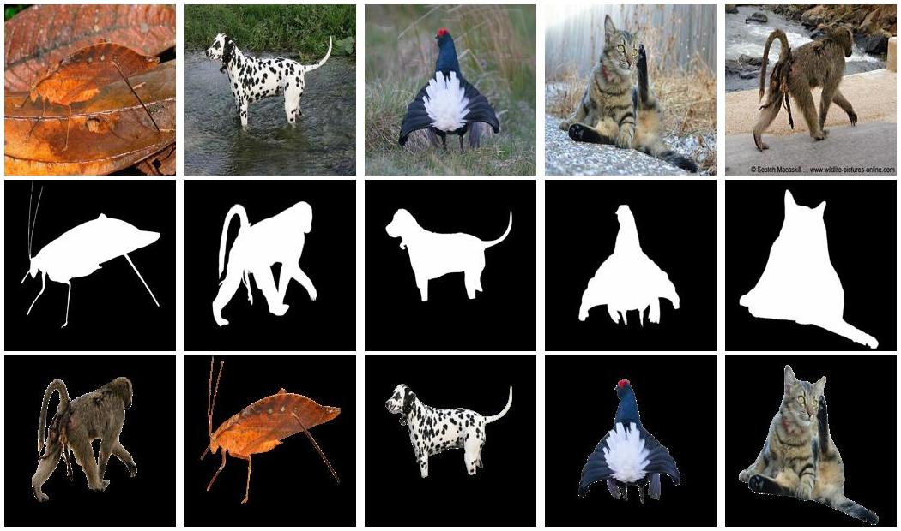
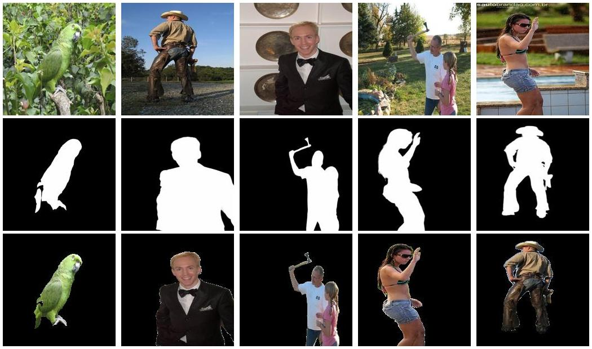
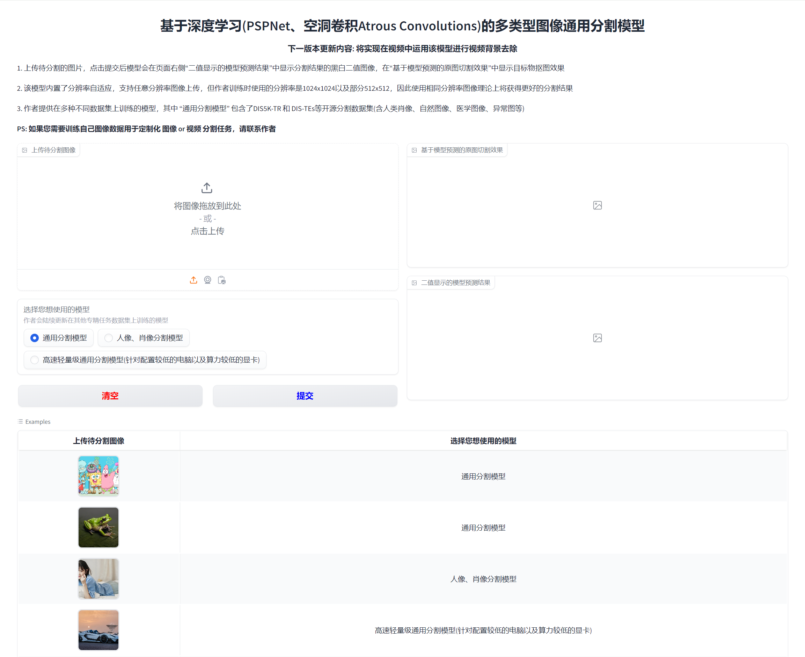
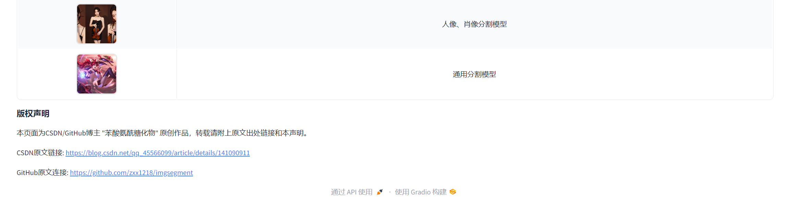

<h1><center>基于深度学习(PSPNet、空洞卷积Atrous Convolutions)的多类型图像通用分割模型</center></h1>
<h3><center>更多基于深度学习的毕业设计请关注专栏 --- <a href="http://t.csdnimg.cn/ZTAtt">计算机毕业设计</a></center></h3>

<p></p>

## :sparkles: 动物图分割（使用训练集DIS5K-TR，DIS-TEs，DUTS-TR_TE ）



## :sparkles:自然与人类图像分割（使用训练集P3M-10k，Human、COD ）




<hr>


## :sparkles: 图像分割在线体验

👇
**Web端在线体验地址：**:white_check_mark:[访问这里进行图像分割在线体验](http://qh880639rv62.vicp.fun:49420/):white_check_mark:
**在线体验地址已经集成了训练好的模型，您只需点击选择使用的模型即可！**

:package:：我训练时的数据集“TR-DUTS”在这里下载

```
通过网盘分享的文件：TR-DUTS.zip
链接: https://pan.baidu.com/s/1bZ8GREWbFEFtcDd8j7NV5g?pwd=6633
提取码: 6633
```

:package:：我训练时的数据集“CHAMELEON”在这里下载

```
通过网盘分享的文件：CHAMELEON.zip
链接: https://pan.baidu.com/s/1T8BKWvuNWzcgl-cB1tEU1w?pwd=vckd 提取码: vckd
```

**在线体验使用方式：**
&emsp;&emsp;打开连接后，左侧图片输入框需要上传待分割的图片。**在网页下方提供了几组输入图片样例，点击样例自动填充到相应位置后即可直接点击提交查看效果。**

**注意：** 修复第一张图的时候耗时较长，大约15秒左右。从第二张图开始，速度就会快起来，大约5秒左右一张（这主要是因为第一次启动的时候模型需要加载进显卡中）




<hr>


## 模型研究背景

&emsp;&emsp;图像分割是计算机视觉中的一项关键技术，其研究背景涵盖了多个应用领域。在医学影像分析中，图像分割用于自动提取解剖结构、病灶区域以及其他重要特征，从而辅助医生进行诊断和治疗规划。例如，在MRI和CT图像中，精确的器官或肿瘤分割能够帮助确定病变位置、体积和发展趋势，从而提高治疗效果。此外，在自动驾驶领域，图像分割技术用于实时识别道路、车辆、行人等关键元素，确保自动驾驶系统的安全性和可靠性。在卫星遥感领域，图像分割被广泛应用于土地覆盖分类、环境监测、灾害评估等方面，通过对地表图像的精细分割，科研人员能够更好地分析地球环境变化。在工业制造中，图像分割用于产品质量检测，通过精确分割工件边缘和表面特征，可以实现缺陷检测和尺寸测量，提升生产效率和产品质量。随着深度学习技术的快速发展，图像分割技术在各个领域的应用不断扩展，其研究背景涵盖了从基础理论到应用开发的广泛内容，具有重要的科学价值和实际意义。

## 模型介绍

&emsp;&emsp;本课题构建的图像分割模型基于PSPNet和空洞卷积（Atrous Convolutions），特别是在处理多尺度场景和捕捉细节特征时表现出色。其中，PSPNet（Pyramid Scene Parsing Network）通过引入金字塔池化模块（Pyramid Pooling Module），有效整合了不同尺度下的上下文信息，增强了模型对全局和局部特征的捕捉能力。

&emsp;&emsp;在此基础上，本课题进一步引入空洞卷积来扩展卷积核的感受野，同时保持分辨率不变。通过使用不同扩张率的空洞卷积，我们能够捕捉到更丰富的多尺度特征，而不增加计算量或降低特征图的分辨率。这种结合使得模型不仅能够有效处理复杂的场景和背景，还能够精细分割物体的边缘和细节区域。在整个模型架构中，空洞卷积被应用于主干网络的各个层级，以增强特征提取的广度和深度，而PSPNet则在最终分割阶段综合不同层级的特征信息，输出高精度的分割结果。

&emsp;&emsp;此外，本课题还使用了一种新颖的渐进式网络来处理高分辨率分割任务作为本项目的创新点。该网络包括独立的定位和重建模块。在定位模块中，本课题从视觉Transformer主干中提取分层特征，这些特征在深层中被合并和压缩，从而在低分辨率下获得对目标物精准的预测。

## 模型性能指标测试

- 稍后上传

<hr>


## :rocket: 算法模型获取

- Giuhub链接：[GitHub链接](https://github.com/zxx1218/imgsegment)
- Gitee链接：[Gitee稍后提供]()

**PS：如果通过Github访问项目，需要挂梯子。请不要通过“加速通道”访问，因为我们的代码常有更新，加速通道中的项目版本可能较老**

### 运行要求

- 运行算法与Web前端需要 Python >= 3.9
- 我提供在多数据集上训练过的模型文件，建议使用带有Nvidia（英伟达）系列的显卡（例如常见的GeForce 1060、3050、3090、4090等都是Nvidia系列的）
- **如果电脑没有合适的显卡也可使用该模型（需通过内存加载模型并丢给CPU进行推理计算，推理速度会慢很多）**

<hr>


## :zap:模型所需环境配置及使用方法（Windows / Linux 均适用）

### 环境配置

#### 方式一：使用conda安装环境

```
# 从github上Clone项目（需要你安装了git工具）
git clone https://github.com/zxx1218/imgsegment.git

# 使用conda创建环境
conda create -n imgsegment python=3.9
conda activate imgsegment

# 安装依赖
pip install -r requirements.txt 
```

#### 方式二：使用Docker

```
# 联系作者咨询，联系方式在文末
```

### 算法模型使用

#### 方式一：启动Web端应用（Web端框架自带移动端页面自适应）

 **\* 效果同上述在线体验连接**

 启动web端命令（会启动在127.0.0.1:xxxx的本机环回地址下)

```
python gradioDemo.py
```

回车后会自动启动Web服务，在控制台看到如下信息代表成功启动，在浏览器打开弹出的URL即可👇

**注：项目也支持进行基于Python的FastApi后端服务部署（针对Web服务器部署）。如有需要，联系作者，联系方式在文末**

### 方式二：大批量图像批量分割（通过控制台 / cmd / 终端）

执行如下命令：

```
# 首先cd到算法代码根目录下
cd imgsegment

# 将待修复图片放在指定文件夹，例如./images文件

# 执行脚本文件即可（注意修改脚本文件中待分割图像的存储目录）
python predict.py
```

<hr>


## 算法模型使用演示视频（桌面应用 & Web前端 & 控制台）

### 1. 访问Web页面进行图像修复

Web端在线体验地址：:white_check_mark:[访问这里进行图像修复在线体验](http://qh880639rv62.vicp.fun:49420/):white_check_mark:

- 视频稍后上传

### 2. 通过控制台（cmd - 终端）进行修复


<hr>


## :wrench:	如何自己训练模型?

- 训练自己想要的定制化图像修复模型**只需要准备好针对需要修复图片的同类型图片数据即可**，具体训练方式请咨询作者

<hr>


## 作者联系方式：

- **VX：Accddvva**
- **QQ：1144968929**
- Github提供训练好的模型文件以及调用该文件进行修图的测试代码（**Github开源代码中不含模型定义源码以及训练代码。只提供可供测试的模型文件，拉取Git代码后安装环境可进行修图测试**）
- 该项目完整代码 + 详细环境配置（如有需要可提供模型远程部署） + Web端 + 训练方式以及代码 == 价格300RMB
- 如果你的电脑没有合适的GPU，或需要自行训练私有数据而自己的GPU现存或性能不够，作者另提供GPU服务器短期租赁服务，24G显存+64G内存云服务器每周 100RMB

<hr>


## Advertisement：

- 作者于浙江某985高校就读人工智能方向研究生，可以帮忙定制设计模型，并提供代码和训练后的模型文件以及环境配置和使用方法，只需要描述需求即可
- 人工智能领域，尤其是计算机视觉（Computer vision，CV）方向的模型or毕业设计，只要你想得出，没有做不出的
